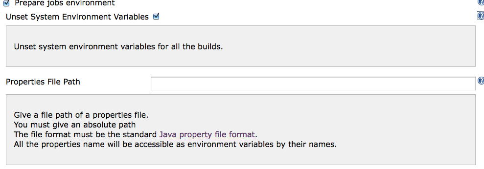
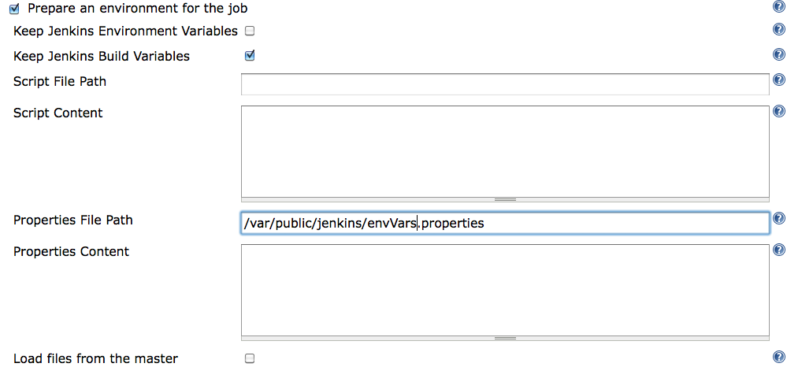
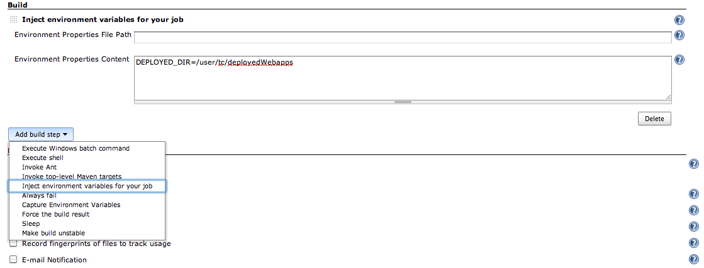
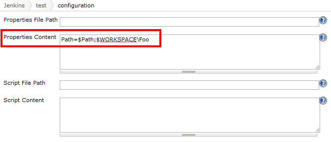

# EnvInject Plugin for Jenkins

[](https://plugins.jenkins.io/envinject)
[](https://github.com/jenkinsci/envinject-plugin/releases/latest)
[](https://plugins.jenkins.io/envinject)

This plugin makes it possible to setup a custom environment for your jobs.

Features:
* Removes inherited environment variables by the Jenkins Java process
* Injects environment variables at node (master/agent) startup
* Executes a setup script before or/and after a SCM checkout for a run
* Injects environment variables before or/and after a SCM checkout for a run
* Injects environment variables as a build step for a run
* Securely injects password values for a run
* Exports environment variables at the end of the build in order to display the set of environment variables used for each build

## Use cases

-   To remove inherited environment variables (`PATH`, `ANT_HOME`, ...) at
    node level (master/agent), available by default for a job run.
-   To inject variables in the first step of the job (before the SCM checkout)
-   To inject variables based on user parameter values
-   To execute an initialization script before a SCM checkout.
-   To execute an initialization script after a SCM checkout
-   To inject variables as a build step obtained from a file filled in
    by a previous build step
-   To know environment variables used for a build
-   To inject build cause as environment variable for a build
-   To inject environment variables from the evaluation of a Groovy
    script (powered by [Script Security Plugin](https://wiki.jenkins.io/display/JENKINS/Script+Security+Plugin))
-   To export environment variables as a metadata in your binary
    repository

## Configuration

### At node (master and agent) level



### At job level

#### Set up a clean environment



#### Inject variables after a SCM checkout


#### Inject variables as a build step



## Advanced use-cases

### Variables Traceability

Each build captures environment variables and stores them in an environment file called 'injectedEnvVars.txt' located in  
`$JENKINS\_HOME/jobs/\<your\_job\>/builds/\<your\_build\>`.
For an old build, you can display injected environment variables through the right UI menu on the build page.

You can also get build environment variables by the following HTTP GET URL:
`\<jenkins\_url\>/job/\<job\_name\>/\<build\_number\>/injectedEnvVars/export`.  
XML, JSON and TXT format are supported.  

For example:

-   `curl -X GET -H"Accept:text/plain" <jenkins_url>/job/<job_name>/lastBuild/injectedEnvVars/export`
-   `curl -X GET -H"Accept:application/xml" <jenkins_url>/job/<job_name>/18/injectedEnvVars/export`
-   `curl -X GET -H"Accept:application/json" <jenkins_url>/job/<job_name>/18/injectedEnvVars/export`

### Build Causes

This plugin also exposes the cause of the current build as an environment variable.
A build can be triggered by multiple causes at the same time e.g. an SCM Change could have occurred at the same time as a user triggers the build manually.

The build cause is exposed as a comma separated list:

```
BUILD_CAUSE=USERIDCAUSE, SCMTRIGGER, UPSTREAMTRIGGER, MANUALTRIGGER
```

In addition, each cause is exposed as a single environment variable too:

```
BUILD_CAUSE_USERIDCAUSE=true
BUILD_CAUSE_SCMTRIGGER=true
BUILD_CAUSE_UPSTREAMTRIGGER=true
BUILD_CAUSE_MANUALTRIGGER=true
```

## Examples

### Append to PATH on Windows



This screenshot is from an older version of EnvInject. Starting with EnvInject 1.93, any backslashes (such as Windows directory separators) in environment variables should be escaped (doubled).
See [JENKINS-31573](https://issues.jenkins-ci.org/browse/JENKINS-31573)

### Gerrit Trigger plugin with parameterized Build branch name

-   Check "**This build is parameterized**"
    -   Name: `GERRIT_BRANCH`
    -   Default Value: `master`
-   Check "**Prepare an environment for the run**"
    -   **Evaluated Groovy script**:

```groovy
if (!binding.variables.containsKey('GERRIT_REFSPEC')) {
    return [GERRIT_REFSPEC: "refs/heads/$GERRIT_BRANCH"]
}
```

## Additional features provided by other plugins

[Shared Objects Plugin](https://plugins.jenkins.io/shared-objects) contributes to EnvInject plugin that enables you to populate shared objects as environment variables.

## Extensibility with other plugins

EnvInject captures build environment variables populated by plugins providing environment variables through Jenkins extension points 
(such as BuildWrappers, EnvironmentContributions and so on).  
Environment variables injected by the EnvInject plugin are available in Jenkins triggers
(for example in all [XTrigger plugin](https://plugins.jenkins.io/xtrigger) typologies, injected environment variable can be used).  
Injected environment variables with the EnvInject plugin are captured by the [BuildContext capture plugin](https://plugins.jenkins.io/buildcontext-capture).

## Comparison with other plugins

This plugin is an alternative to [Setenv
Plugin](https://wiki.jenkins.io/display/JENKINS/Setenv+Plugin) and
[Envfile Plugin](https://plugins.jenkins.io/envfile) plugins which are currently deprecated.

* Note 1: The EnvInject plugin automatically migrates the Jobs configuration from these plugins.
The setenv and/or the envfile plugins can be deleted from your plugin list.  
* Note 2: Master and agents are managed.

## Known limitations

## Jenkins Pipeline compatibility

Even though it is possible to set up the EnvInject Job Property and
build step in Pipeline, the plugin does not provide full compatibility
with [Jenkins Pipeline](https://jenkins.io/doc/book/pipeline/).

Supported use-cases:

-   Injection of EnvVars defined in the "Properties Content" field of
    the Job Property
    -   These EnvVars are being injected to the script environment and will be inaccessible via the "env" Pipeline global variable
    -   Please note there is also a known compatibility issue with [Durable Task Plugin](https://plugins.jenkins.io/durable-task) 1.13

All other use-cases of the plugin may work incorrectly in Jenkins Pipeline.
Please
see [JENKINS-42614](https://issues.jenkins-ci.org/browse/JENKINS-42614) for more information about unsupported use-cases.
There is no short-term plan to fix the compatibility issues though any pull requests to the plugin will be appreciated.

### Mask Passwords Plugin compatibility

Mask Passwords plugin is able to mask password elements.
However, technically, this plugin provides its own class.
And we don't want to have a hard dependency from the EnvInject plugin to any other plugin.

Therefore, EnvInject can't retrieve information from the MaskPassword plugin.
However, EnvInject provides all MaskPassword's features.

### Tool Environment Plugin compatibility

EnvInject can't use exported environment variables provided by the [Tool Environment](https://plugins.jenkins.io/toolenv) plugin.  
Instead, we suggest to use the [SharedObjects Plugin](https://plugins.jenkins.io/shared-objects).
It covers Tool Env plugin features and provides a good integration with EnvInject.

### Other limitations

-   As into regular shell scripts, you are not able to use the "." character for environment variable names
-   Only previous environment variables are available for polling.

Some plugins provide polling mechanisms (such as SCM plugins, XTrigger plugins, ...) and you want to use injected environment variables in form fields of these plugins.
Unfortunately, injected environment variables are processed only at build time therefore after the build is scheduled.
Therefore, we can't access environment variables configured within the job.
However, previous injected environment variables (from the previous build) are retrievable
(implemented for example in the XTtrigger plugins).
For the other plugins, authors are free to add the [EnvInject API](https://plugins.jenkins.io/envinject-api) dependency in their plugins in order to provide the ability to use environment variables given the EnvInject plugin.

## Changelog

See [GitHub Releases](https://github.com/jenkinsci/envinject-plugin/releases) for recent releases.
Changelogs for EnvInject 2.1.6 and older releases are available on the [Old Changelog](./docs/CHANGELOG_OLD.md) page.
